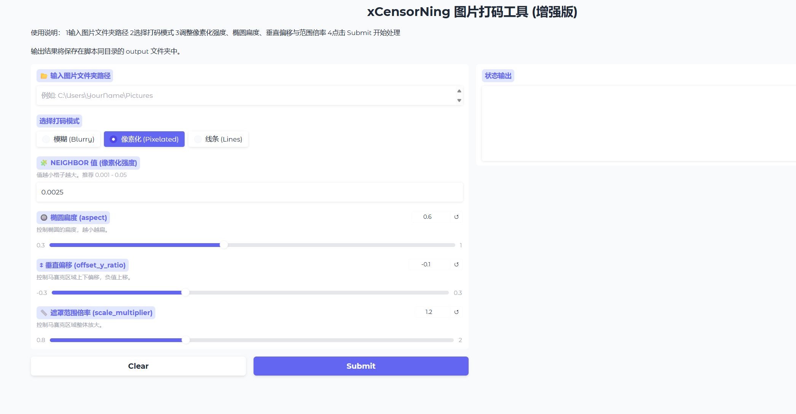

# xCensorNing 打码工具 - 可调椭圆扁度与垂直偏移版

xCensorNing is a simple image censoring tool that allows you to blur specific parts of an image.xCensorNing是一个简单的图像审查工具，允许您模糊图像的特定部分。



## Installation

To install xCensorNing, simply clone this repository:要安装xCensorNing，只需克隆这个存储库：

```sh
git clone <this-repo>
```

Install the required dependencies using pip:使用pip安装所需的依赖项：

```sh
pip install -r requirements.txt
```

## Usage

To use xCensorNing, simply run the `start_xCensorNing.bat` script and follow the prompts.

```sh
python xCensorNing.py
```

Open `http://127.0.0.1:2333`, then have fun!

The image will be saved as `./output` in the same directory as the script.

## Thanks

The main YOLO model and Implement used in this project is from https://github.com/zhulinyv/Semi-Auto-NovelAI-to-Pixiv.git本项目中使用的主要YOLO模型和实现来自https://github.com/zhulinyv/Semi-Auto-NovelAI-to-Pixiv.git

## License

AGPL-3.0 (same as https://github.com/zhulinyv/Semi-Auto-NovelAI-to-Pixiv.git)AGPL-3.0（同https://github.com/zhulinyv/Semi-Auto-NovelAI-to-Pixiv.git）
